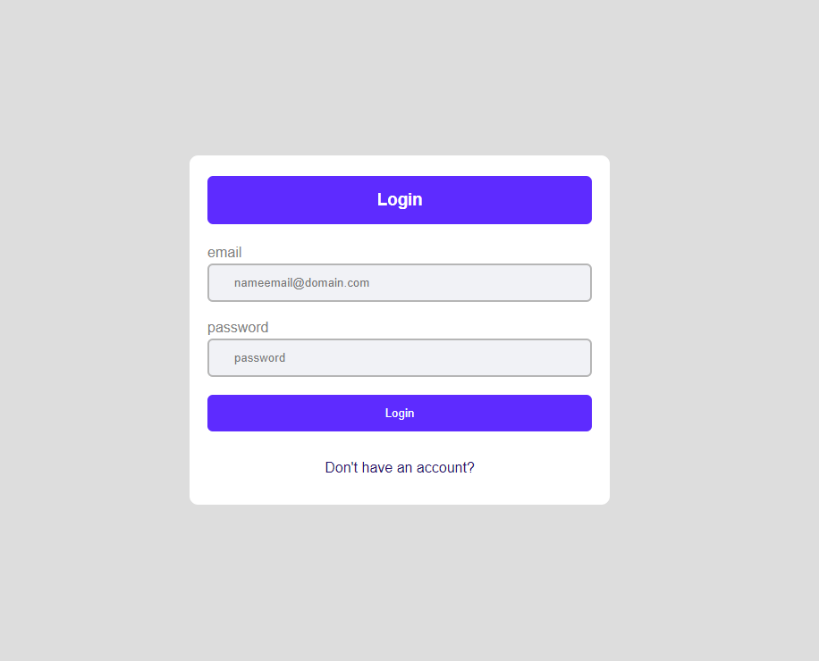
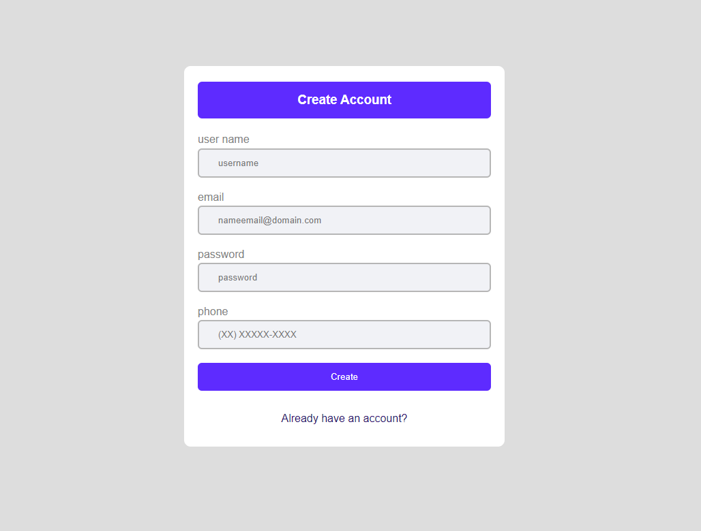

# Form - JS

Este Projeto foi criado para praticar a criação de formularios responsivos com o auxilio do React-Hook-Form para fazer a autenticação dos dados do usuario.
## Funcionalidades

- autenticação dos dados do usuario
- mudança de pagina sem reload
- mensagens de erro 

## Stack utilizada

**Front-end:** React, React-Router-DOM, React-Hook-Form, Styled-Components 

## Screenshots





## Rodando localmente

Clone o projeto

```bash
  git clone https://github.com/renan-nixdorf/FormJs.git
```

Entre no diretório do projeto

```bash
  cd FormJS
```

Instale as dependências

```bash
  npm install
```

Inicie o servidor

```bash
  npm run dev
```


## Aprendizados

Autenticação de dados com um lib que nunca tinha usado antes foi um desafio e tambem muito educativo pois me instigou a saber mais sobre a biblioteca e como cada função funciona.

## Feedback

Se você tiver algum feedback, por favor me envie. :)


## Autor

- [@renan-nixdorf](https://github.com/renan-nixdorf)

